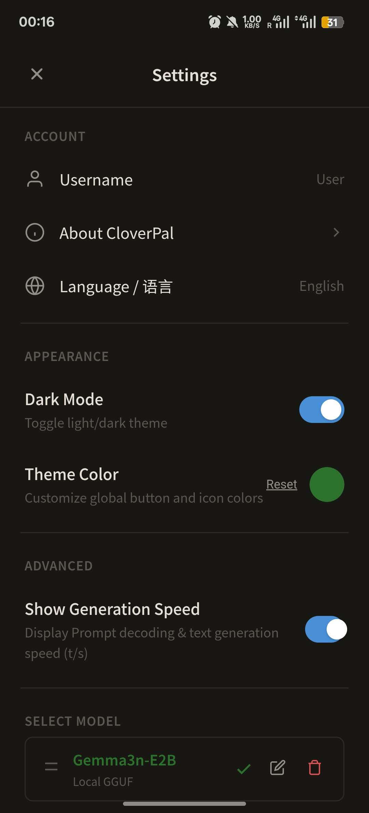

# CloverPal☘️-offline Silly Tarven AI on Android

  
  
  
  

CloverPal is an **Android** application designed for **local/offline Large** Language Model (LLM) inference. It's hardcore, fully **offline** LLM client for Android. Powered by deeply optimized llama.cpp (ARMv8.4 DotProd), featuring **HTML Live Preview, file reading, LaTeX rendering**, and an innovative **Offline Silly Tavern** mode for multi-character roleplay. 100% on-device.

[Download CloverPal Here](https://github.com/Spike8086/CloverPal/releases/download/v1.0.8/CloverPal_v1.0.8.apk)

## Features

* UI Design: A minimalist user interface focused on readability and straightforward navigation.
* Document Parsing: Supports reading small document files (.txt, .docx, .pdf) to include their contents directly within the chat context.
* Chat Functionality: Includes essential chat controls such as message editing, response regeneration, and the ability to configure both system and user prompts.
* Theme Customization: Users can adjust the global accent color of the interface.
* Model Storage Options: Supports importing models via external storage direct-read mode (to save device space) or internal copy mode (for file stability).
* Model Architecture Compatibility: Supports modern architectures including the Qwen3.5 architecture, Qwen3's Soft Thinking mechanism, and the Gemma3n series.
* Dual-Language Support: The application interface is available in both English and Simplified Chinese.
* Latex Support: Support the expression of **LaTeX** using KaTeX.
* HTML Preview: Allow user to have a preview to the html code like a browser.
* Offline Tarven: Model could using different system prompts to talk to itself
  

  
  
  

  
  
  

## Technical Specifications

* Operating System: Android
* SDK Requirements: Minimum SDK 28 (Android 9.0), Target SDK 35 (Android 15).
* Inference Engine: The underlying text generation is powered by **llama.cpp**.

## Disclaimer

This application provides a framework for local computation only. CloverPal operates strictly offline and does not collect, store, or transmit any private user data, chat histories, or uploaded files to any external servers. The text generated by the AI models loaded into this application does not reflect the views or positions of the developer. Users are solely responsible for the models they choose to import and the outputs generated during usage.

## License

This project is licensed under the **GNU AGPL-3.0 License** - see the [LICENSE](LICENSE) file for details. 
*(You are free to use, modify, and distribute this software, but any modified versions or services utilizing this code must also be open-sourced under the same AGPL-3.0 license.)*

## Acknowledgements

CloverPal is built using the amazing work from:

* **[llama.cpp](https://github.com/ggerganov/llama.cpp)**: Enables efficient inference of LLMs on local devices.
* **[Capacitor](https://capacitorjs.com/)**: The cross-platform native runtime powering the mobile experience using web technologies.
* **[marked](https://github.com/markedjs/marked)**: A low-level markdown compiler used for rendering chat responses.
* **[mammoth.js](https://github.com/mwilliamson/mammoth.js)**: Enables text extraction and parsing from document (.docx) files.
* **[KaTeX.js](https://github.com/KaTeX/KaTeX)**: Enable render LaTeX expression.
* **[pdf.js](https://github.com/mozilla/pdf.js/)**: Enable reading pdf flies.
  
And many other open source libraries that make this project possible!

## ⭐ Support the Project
If you find CloverPal useful, please consider giving this repo a star ⭐ — it's free, takes just one second, and means a lot to an independent developer!
Every star helps more people discover CloverPal and motivates continued development of new features and optimizations. Thank you for your support! 🍀
