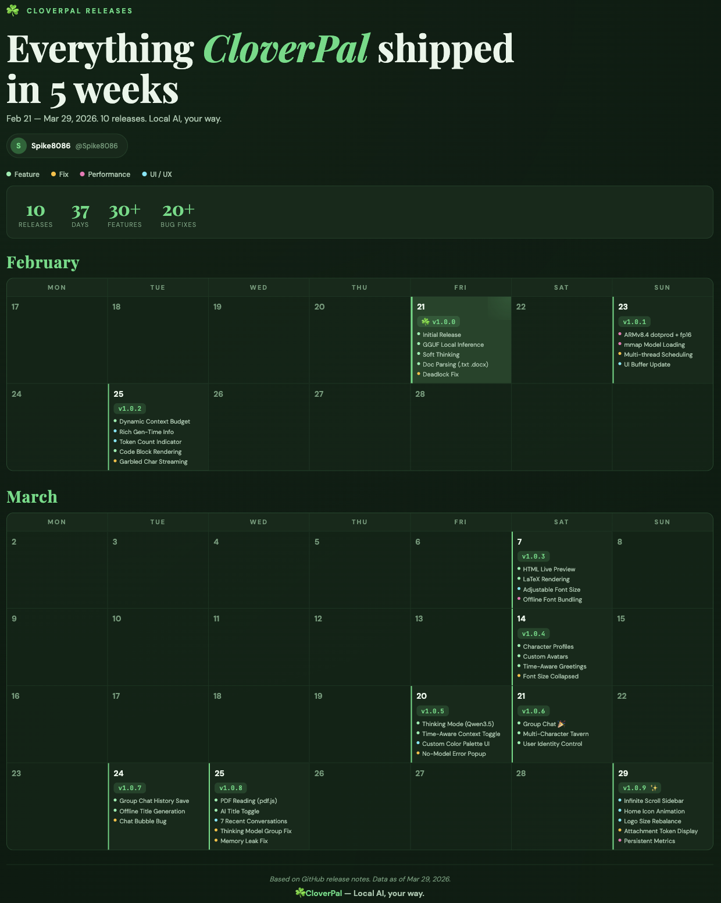

[English](./README.md) | [简体中文](./README_CN.md)

# CloverPal☘️ — 能跑离线酒馆的安卓AI聊天APP

  
  
  
  

CloverPal 是一款硬核的安卓**纯离线**大模型客户端。底层由深度优化的 llama.cpp（ARMv8.4 DotProd）驱动，支持 **HTML 实时预览、文档阅读、LaTeX 公式渲染、语音识别**，以及创新的**离线酒馆模式**——多角色扮演群聊。100% 本地推理，数据绝不离开你的手机。

**安卓版 (v1.1.5)：** [点击下载 CloverPal](https://github.com/Spike8086/CloverPal/releases/download/v1.1.5/CloverPal_v1.1.5.apk)

**iOS 版：** 即将推出

## 功能亮点

- **极简 UI** — 专注阅读体验的简洁界面，支持全局主题色、亮色/暗色/自定义背景、字体大小调节。
- **七国语言** — 简体中文、繁體中文、English、日本語、한국어、Español、Français。
- **文档解析** — 直接将 `.txt`、`.docx`、`.pdf` 文件内容注入对话上下文。
- **LaTeX 渲染** — 通过 KaTeX 渲染数学公式。
- **HTML 实时预览** — 在聊天中直接预览 AI 生成的 HTML 代码，支持 Canvas 和 JavaScript。
- **离线酒馆** — 创建带自定义头像和系统提示词的角色，让 2-3 个 AI 角色在群聊中互相对话。
- **语音识别** — 基于 whisper.cpp 的离线语音转文字，自动检测 99 种语言，无需联网或谷歌服务。
- **智能对话管理** — 消息编辑、重新生成、收藏对话、批量删除、自动生成标题、全文搜索。
- **灵活的模型导入** — 外部直读（省空间）或内部复制（更稳定），还可一键从 HuggingFace / ModelScope 下载推荐模型。
- **架构支持** — Qwen3.5、Qwen3（软思考）、Gemma 4、Gemma 3、LLaMA 等 GGUF 兼容模型。
- **思考模式控制** — 按模型切换思考开关，选择格式（Qwen3.5 / Qwen3 / Gemma 4），并设置思考 Token 预算。

  
  
  

  
  
  

  

## 技术规格

- **操作系统：** Android
- **SDK 要求：** 最低 SDK 28（Android 9.0），目标 SDK 35（Android 15）
- **推理引擎：** llama.cpp
- **语音引擎：** whisper.cpp

## 免责声明

本应用仅提供本地计算框架。CloverPal 严格离线运行，绝不收集、存储或传输任何用户隐私数据、聊天记录或上传的文件到任何外部服务器。AI 模型生成的文本内容不代表开发者的观点或立场。用户需自行对所导入的模型及其输出内容负责。

## 开源协议

本项目基于 **GNU AGPL-3.0** 协议开源 — 详见 [LICENSE](LICENSE) 文件。
*（你可以自由使用、修改和分发本软件，但任何修改版本或基于本代码的服务都必须以相同的 AGPL-3.0 协议开源。）*

## 致谢

CloverPal 的诞生离不开以下优秀的开源项目：

- **[llama.cpp](https://github.com/ggerganov/llama.cpp)** — 高效的端侧大模型推理引擎。
- **[whisper.cpp](https://github.com/ggerganov/whisper.cpp)** — 离线语音转文字。
- **[Capacitor](https://capacitorjs.com/)** — 跨平台原生运行时。
- **[marked](https://github.com/markedjs/marked)** — Markdown 渲染器。
- **[mammoth.js](https://github.com/mwilliamson/mammoth.js)** — DOCX 文本提取。
- **[KaTeX](https://github.com/KaTeX/KaTeX)** — LaTeX 公式渲染。
- **[pdf.js](https://github.com/mozilla/pdf.js/)** — PDF 阅读器。

以及更多让本项目成为可能的开源工具！

## ⭐ 支持项目

如果你觉得 CloverPal 好用，请给这个仓库点一个 Star ⭐ — 免费、只需一秒，对独立开发者意义重大！每一颗 Star 都能帮助更多人发现 CloverPal，也是持续更新的动力。感谢你的支持！🍀
